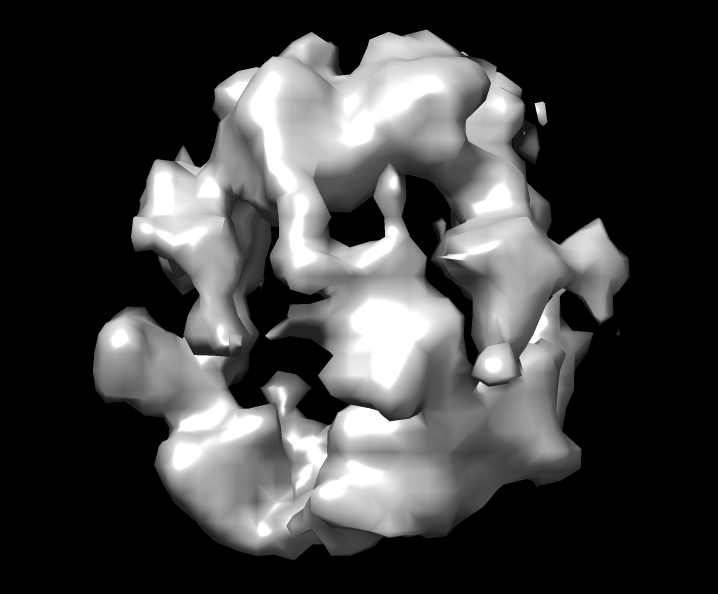
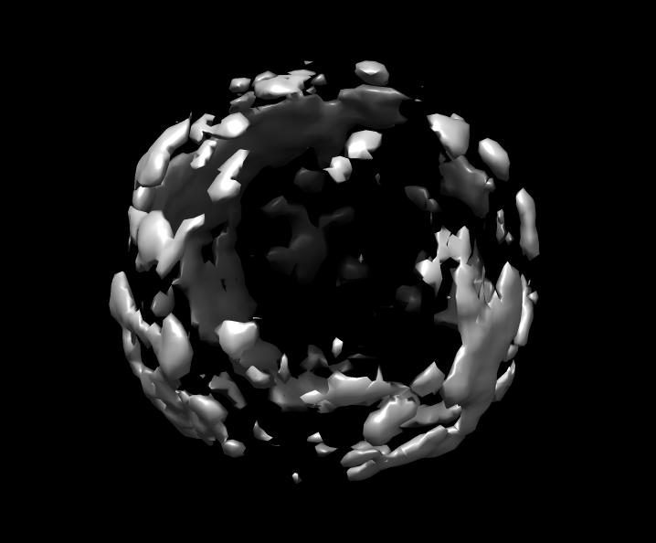
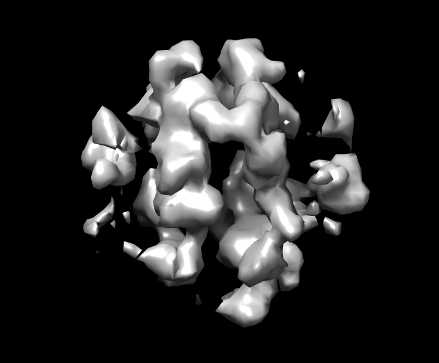

## CryoEM-Data-Synthesis

​	A GAN and VAE based framework for synthesizing 3D Cryo-EM maps.

#### Usage

1. Download the dataset from [EMDataBank PDBeShape test set](https://www.ebi.ac.uk/pdbe/emdb/test_data.html).

2. Install [RELION](https://www3.mrc-lmb.cam.ac.uk/relion/index.php?title=Main_Page).

3. Install all the dependency by 

   `pip install -r requirements.txt`

4. Set the dataset path and run

   `python preprocessing.py`

5. Run the following command to train the model.

   `python main.py`

   

#### Results

#### Reference

1. [Learning a Probabilistic Latent Space of Object Shapes via 3D Generative-Adversarial Modeling](https://arxiv.org/pdf/1610.07584.pdf)